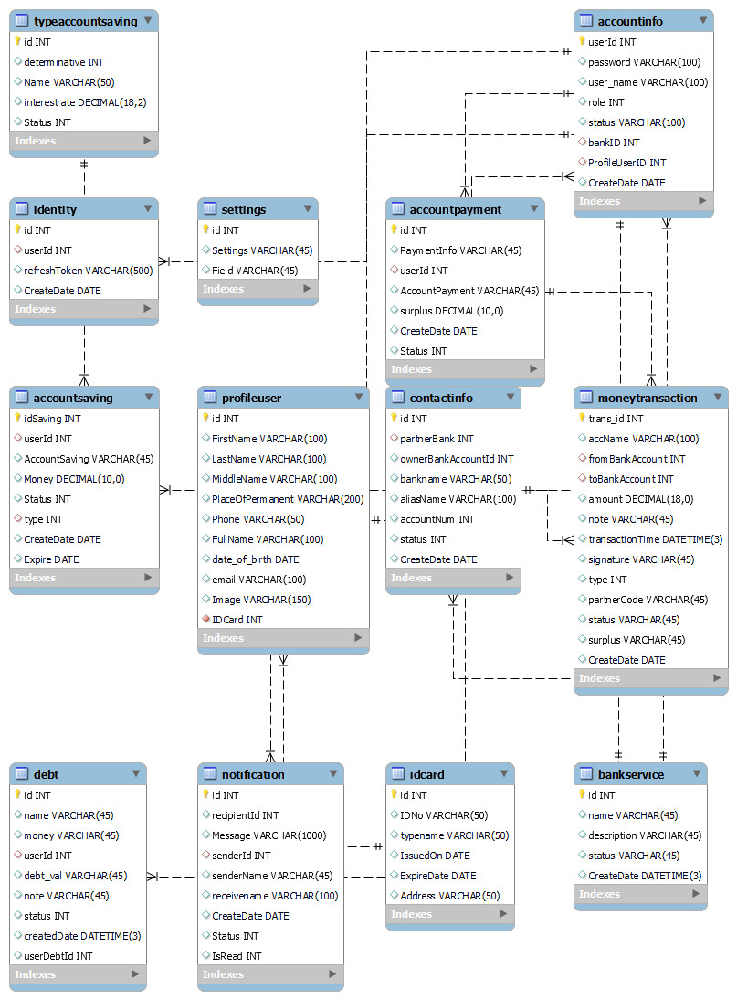

# Banking Transaction

- Hoàng Minh Thanh (21C11029)
- Trần Hữu Nghĩa (21C12005)
- Nguyễn Trần Khánh Nguyên (21C11017)

## Database




## Slices Powerpoint

https://studenthcmusedu-my.sharepoint.com/:p:/g/personal/21c11029_student_hcmus_edu_vn/EYXanqTw8INOt4ZS7HW5BOwBB4bU3NEZF_LL2hiYt1e7aA?e=6e1Mdl

## Reports

https://docs.google.com/document/d/1Cr5SITGvZPOesokZL7dvpQvYU0RfHKgL/edit?usp=sharing&ouid=101317885364901782984&rtpof=true&sd=true

## Project Struct

Project use mysql install mysql workbench to connect data base use config blow.

```
DB_HOST=localhost
DB_PORT=5200
USER=root
DB_PASSWORD=password
DB_BANKING_NAME=Internet_Banking
```

### Backend API :

View at http://localhost:5500/

```bash
npm install
npm start
```

### Front End

View at http://localhost:3000/

```bash
npm install

npm start
```
